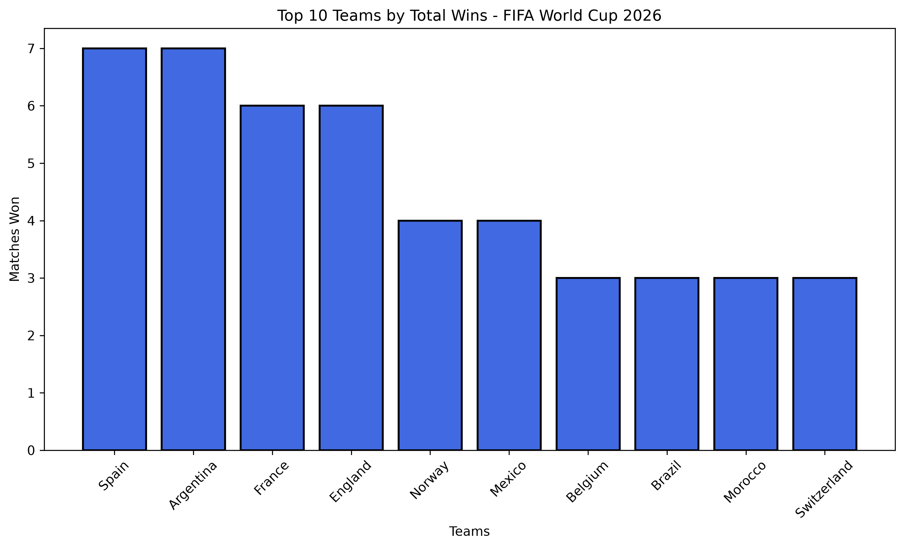
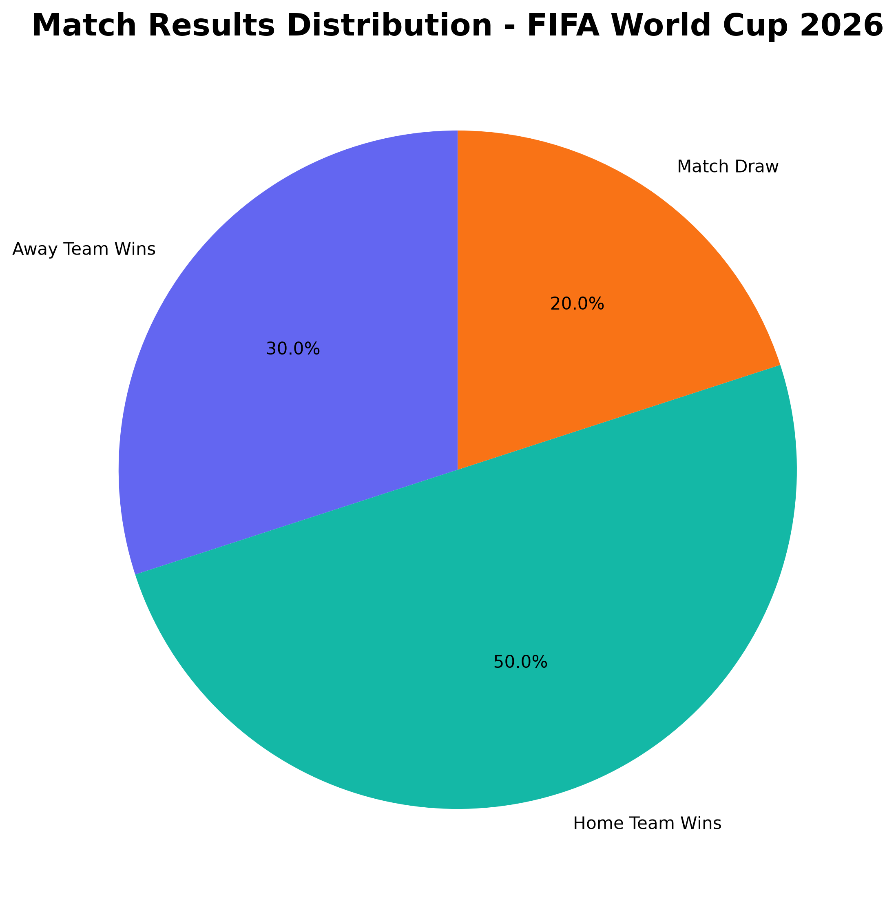
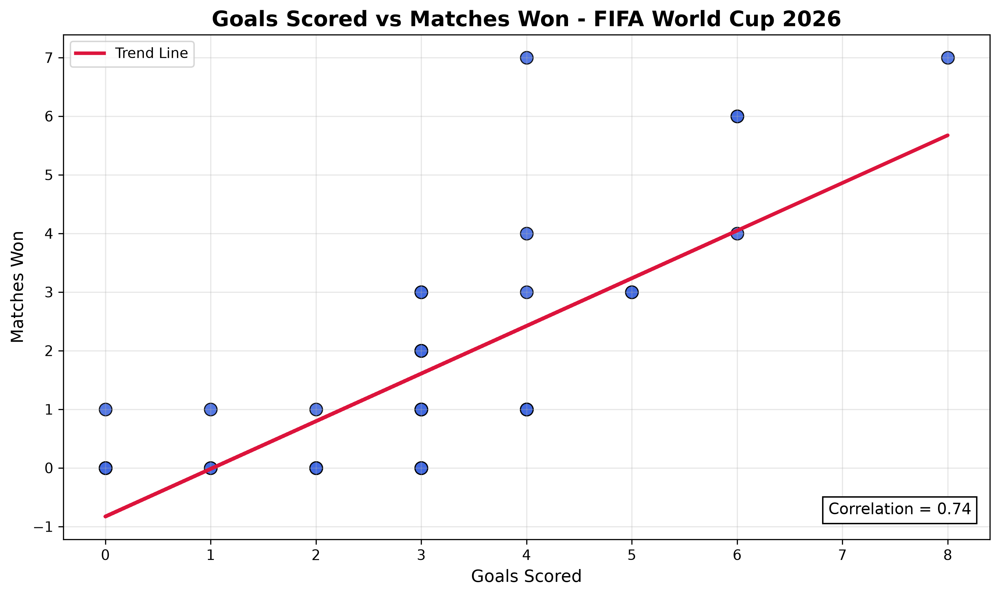

# ⚽ FIFA World Cup 2026 Data Analysis

Exploratory Data Analysis (EDA) on FIFA World Cup 2026 match data using Python, Pandas, NumPy, and Matplotlib.



## 📁 Directory Structure

```text
FIFA-World-Cup-2026-Data-Analysis/
│
├── data/
│   └── matches.csv
│
├── images/
│   ├── wins.png
│   ├── goals_scored.png
│   ├── goals_conceded.png
│   ├── goal_difference.png
│   ├── match_results.png
│   ├── goals_per_match_distribution.png
│   ├── avg_goals_by_round.png
│   ├── highest_scoring_matches.png
│   └── scatter_plot.png
│
├── FIFA_World_Cup_2026_Analysis.ipynb
├── README.md
├── requirements.txt
└── LICENSE
```

## 📌 Project Overview

The FIFA World Cup 2026 analysis explores match data to discover key insights regarding:
- Team performance (Wins, Losses, Draws)
- Goal scoring trends and match outcome relationships
- Goals scored vs. goals conceded (Goal Difference)
- Distribution of goals per match and round-by-round trends

## ✨ Key Features

- Data cleaning and preprocessing
- Team performance analysis
- Goal scoring analysis
- Match result distribution
- Tournament round analysis
- Correlation analysis
- 9 professional visualizations

## 🛠️ Installation & Requirements

Install the dependencies:

```bash
pip install -r requirements.txt
```

### Dependencies
- `numpy`
- `pandas`
- `matplotlib`

## 📊 Visualizations

All graphs generated by the notebook are automatically exported to the `images/` directory:
- `wins.png` — Top 10 Teams by Total Wins
- `goals_scored.png` — Top 10 Teams by Goals Scored
- `goals_conceded.png` — Top 10 Teams by Goals Conceded
- `goal_difference.png` — Top 10 Teams by Goal Difference
- `match_results.png` — Match Results Distribution (Home Wins / Away Wins / Draws)
- `goals_per_match_distribution.png` — Distribution of Goals per Match
- `avg_goals_by_round.png` — Average Goals per Match by Tournament Round
- `highest_scoring_matches.png` — Top 10 Highest Scoring Matches
- `scatter_plot.png` — Relationship between Goals Scored and Matches Won

## 📸 Sample Visualizations

### Top Teams by Wins


### Match Results Distribution



### Goals Scored vs Matches Won




## 🔗 Links

- GitHub Repository: https://github.com/anand-cm140/FIFA-World-Cup-2026-Data-Analysis
- Kaggle Notebook: https://www.kaggle.com/code/your-username/your-notebook

## 📄 License

This project is licensed under the MIT License - see the [LICENSE](LICENSE) file for details.
